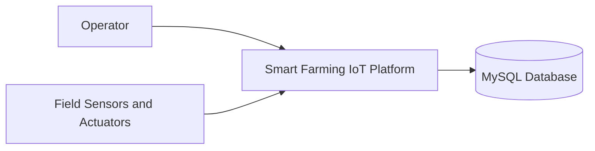
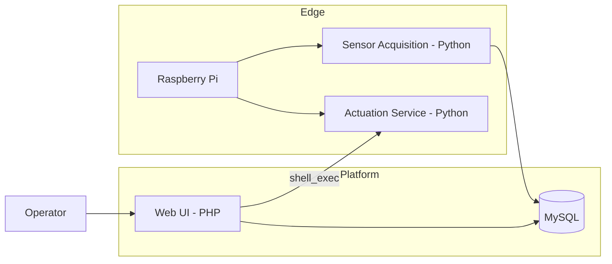
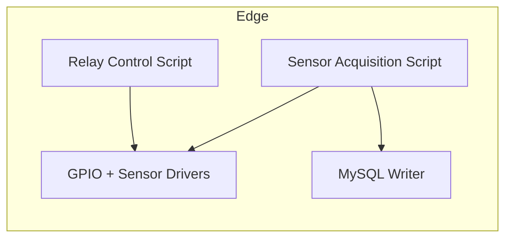

# Smart Farming IoT - Irrigation Control Platform

Smart Farming IoT is a monitoring, control, and actuation platform for irrigation systems using a Raspberry Pi, multiple sensors, and a web interface. The system collects environmental data, persists it in MySQL, and enables remote control of irrigation actuators.

## Overview
- **Goal**: Monitor field conditions and control irrigation with low latency and reliable data storage.
- **Audience**: Irrigation operators, agronomy researchers, and IoT maintenance teams.
- **Scope**: Sensor acquisition, web dashboard, authentication, and relay-based actuation.

## C4 Model
### Level 1 - System Context


### Level 2 - Container Diagram


### Level 3 - Component Diagram (Edge)


## Requirements Engineering
### Stakeholders
- Irrigation operator
- System administrator
- IoT maintenance team

### Functional Requirements
- FR01: Display real-time sensor readings.
- FR02: Persist sensor readings to MySQL.
- FR03: Provide authenticated sessions.
- FR04: Allow relay-based irrigation actuation.
- FR05: Show current actuation state.

### Non-Functional Requirements
- NFR01: Near real-time updates (seconds).
- NFR02: Operate under intermittent connectivity.
- NFR03: Authentication required for actuation.
- NFR04: Low cost and easy maintenance.
- NFR05: Basic logs for audit and troubleshooting.

### Acceptance Criteria (examples)
- AC01: Relay state changes within 2s of UI command.
- AC02: New readings appear in the dashboard within 10s of acquisition.
- AC03: Unauthenticated users are redirected to the login page.

## Tech Stack
- **Web Backend**: PHP
- **Acquisition/Actuation**: Python (GPIO, MCP3008, DHT, BMP180)
- **Database**: MySQL
- **Hardware**: Raspberry Pi

## Repository Structure
```
.
├── app/
│   ├── config/
│   ├── pages/
│   └── security/
├── docs/
├── edge/
│   ├── actuators/
│   ├── firmware/
│   └── sensors/
├── public/
│   ├── assets/
│   │   ├── css/
│   │   ├── img/
│   │   └── js/
│   ├── tests/
│   ├── admin_dashboard.php
│   ├── app_router.php
│   ├── auth_validate.php
│   ├── index.php
│   ├── login.php
│   └── logout.php
├── vendor/
└── README.md
```

## Local Setup (high level)
1. Create a MySQL database named `irriga`.
2. Update credentials in `app/config/db_connection.php` and in Python scripts under `edge/sensors/data/`.
3. Ensure GPIO permissions for the user running PHP.
4. Configure the web server to use `public/` as web root.

## Security
- Authenticated sessions for dashboard access.
- HTTPS recommended for remote access.
- Use a dedicated DB user with least privileges.

## Observability
- PHP and MySQL logs for audit and support.
- Python script logs for sensor diagnostics.

## Suggested Roadmap
- REST API for external integrations.
- Scheduled collection jobs.
- Historical dashboards and alerts.
- Rule-based irrigation control (e.g., soil moisture threshold).

## License
See `license.txt`.
